# Architecture of IbkrApi

This document explains the architecture and design principles of the IbkrApi library, providing context for developers who want to understand how the library works internally.

> #### Architecture Overview {: .info}
>
> The IbkrApi library is designed to provide a **clean, idiomatic Elixir interface** to Interactive Brokers' Client Portal Web API. The library follows Elixir conventions and leverages the language's strengths in **concurrent programming** and **fault tolerance**.

## Overview

IbkrApi is designed as a clean, idiomatic Elixir wrapper around Interactive Brokers' Client Portal API. The library follows these key design principles:

1. **Simplicity**: Providing a straightforward interface to the IBKR API
2. **Consistency**: Maintaining a consistent API design across all modules
3. **Error Handling**: Comprehensive error handling with meaningful messages
4. **Type Safety**: Using structs and typespecs for better code quality

## System Architecture

The IbkrApi library provides two distinct communication channels with the IBKR Client Portal Gateway:

### Dual-Channel Architecture

```mermaid
flowchart TD
    Client["🏢 Client Code"]
    
    %% REST API Channel
    Client --> RestAPI["📡 REST API Calls"]
    RestAPI --> ClientPortal["IbkrApi.ClientPortal"]
    
    ClientPortal --> Auth["🔐 Auth"]
    ClientPortal --> Portfolio["💼 Portfolio"]
    ClientPortal --> Order["📋 Order"]
    ClientPortal --> Contract["📄 Contract"]
    ClientPortal --> Trade["💱 Trade"]
    ClientPortal --> MarketData["📊 MarketData"]
    
    Auth --> HTTP["IbkrApi.HTTP<br/>(Rate Limited)"]
    Portfolio --> HTTP
    Order --> HTTP
    Contract --> HTTP
    Trade --> HTTP
    MarketData --> HTTP
    
    HTTP --> SharedHTTP["IbkrApi.SharedUtils.HTTP"]
    SharedHTTP --> Finch["🌐 Finch<br/>(HTTP Client)"]
    
    %% WebSocket Channel
    Client --> RealTime["⚡ Real-time Data"]
    RealTime --> WebSocket["IbkrApi.Websocket"]
    WebSocket --> WebSockex["🔌 WebSockex<br/>(Behavior)"]
    
    WebSocket --> WSMarketData["📈 Market Data"]
    WebSocket --> WSOrderUpdates["📋 Order Updates"]
    WebSocket --> WSPnL["💰 P&L Streaming"]
    
    %% Gateway
    Finch --> Gateway["🏛️ IBKR Client Portal Gateway"]
    WebSockex --> Gateway
    
    Gateway --> RestEndpoint["🌐 REST API<br/>(Port 5000)"]
    Gateway --> WSEndpoint["🔌 WebSocket API<br/>(wss://localhost:5000/v1/api/ws)"]
    
    %% Styling
    classDef clientCode fill:#e1f5fe
    classDef restApi fill:#f3e5f5
    classDef websocket fill:#e8f5e8
    classDef http fill:#fff3e0
    classDef gateway fill:#fce4ec
    
    class Client clientCode
    class RestAPI,ClientPortal,Auth,Portfolio,Order,Contract,Trade,MarketData restApi
    class RealTime,WebSocket,WebSockex,WSMarketData,WSOrderUpdates,WSPnL websocket
    class HTTP,SharedHTTP,Finch http
    class Gateway,RestEndpoint,WSEndpoint gateway
```



### Communication Channels

The library provides two independent communication channels:

#### 1. REST API Channel (Request/Response)

**Purpose**: Synchronous operations like authentication, account queries, order placement, and historical data retrieval.

**Flow**: `ClientPortal Modules → IbkrApi.HTTP → SharedUtils.HTTP → Finch → IBKR Gateway REST API`

**Key Modules**:
- `IbkrApi.ClientPortal.Auth` - Authentication and session management
- `IbkrApi.ClientPortal.Portfolio` - Account information, positions, P&L
- `IbkrApi.ClientPortal.Order` - Order placement and management
- `IbkrApi.ClientPortal.Contract` - Contract search and information
- `IbkrApi.ClientPortal.MarketData` - Historical market data
- `IbkrApi.ClientPortal.Trade` - Trade execution history

**HTTP Stack**:
- `IbkrApi.HTTP` - Rate-limited HTTP client wrapper
- `IbkrApi.SharedUtils.HTTP` - Core HTTP functionality with Finch
- `Finch` - Elixir HTTP client with connection pooling

#### 2. WebSocket Channel (Real-time Streaming)

**Purpose**: Real-time data streaming for market data, order updates, and portfolio P&L.

**Flow**: `User Module → IbkrApi.Websocket → WebSockex → IBKR Gateway WebSocket API`

**Key Features**:
- `IbkrApi.Websocket` - WebSocket client using WebSockex behavior
- Real-time market data streaming (Level I quotes)
- Live order status updates and fills
- Portfolio P&L streaming
- Automatic heartbeat management
- Topic-based event dispatch to user callbacks

### Core Components

1. **IbkrApi**: The main module that serves as the entry point to the library
2. **IbkrApi.Application**: Manages the application lifecycle and dependencies
3. **IbkrApi.Config**: Handles configuration for the library
4. **IbkrApi.HTTP**: Low-level HTTP client for making requests to the API

### Domain-Specific Modules

The `IbkrApi.ClientPortal` namespace contains domain-specific modules that correspond to different areas of the IBKR API:

1. **IbkrApi.ClientPortal.Auth**: Authentication and session management
2. **IbkrApi.ClientPortal.Account**: Account information and operations
3. **IbkrApi.ClientPortal.Contract**: Financial instruments and contracts
4. **IbkrApi.ClientPortal.Order**: Order placement and monitoring
5. **IbkrApi.ClientPortal.Profile**: User profile information
6. **IbkrApi.ClientPortal.Trade**: Trade executions and history

## Data Flow

A typical request through the library follows this flow:

1. Client code calls a function in one of the domain-specific modules
2. The domain module constructs the appropriate request parameters
3. The request is passed to `IbkrApi.HTTP` which handles the HTTP communication
4. `IbkrApi.HTTP` uses Finch to make the actual HTTP request to the IBKR Gateway
5. The response is received and parsed (typically from JSON to Elixir structs)
6. The domain module returns the structured response to the client code

## Error Handling

The library uses the `ErrorMessage` module for consistent error handling:

```elixir
defmodule ErrorMessage do
  @type t :: %__MODULE__{
    code: String.t() | nil,
    message: String.t() | nil,
    description: String.t() | nil
  }
  
  @type t_res :: {:ok, any()} | {:error, t()}
  
  defstruct [:code, :message, :description]
end
```

All API functions return either `{:ok, result}` on success or `{:error, %ErrorMessage{}}` on failure, allowing for consistent error handling throughout the application.

## Data Structures

The library uses Elixir structs to represent API responses. Each domain module defines its own set of structs that match the structure of the API responses. For example:

```elixir
defmodule IbkrApi.ClientPortal.Auth.CheckAuthStatusResponse do
  defstruct authenticated: nil, competing: nil, connected: nil,
            fail: nil, hardware_info: nil, mac: nil, message: nil,
            server_info: %IbkrApi.ClientPortal.Auth.ServerInfo{}
end
```

This approach provides type safety and makes it clear what data is available from each API call.

## Configuration

The library is configured through the standard Elixir configuration system:

```elixir
config :ibkr_api,
  base_url: "http://localhost:5000/v1/api",
  timeout: 30_000
```

The `IbkrApi.Config` module provides functions to access this configuration:

```elixir
defmodule IbkrApi.Config do
  def base_url, do: Application.get_env(:ibkr_api, :base_url, "http://localhost:5000/v1/api")
  def timeout, do: Application.get_env(:ibkr_api, :timeout, 30_000)
end
```

## HTTP Client

The `IbkrApi.HTTP` module handles all HTTP communication with the IBKR API. It uses Finch for making HTTP requests and Jason for JSON encoding/decoding:

```elixir
defmodule IbkrApi.HTTP do
  @spec get(String.t()) :: ErrorMessage.t_res()
  def get(url) do
    # Implementation...
  end

  @spec post(String.t(), map()) :: ErrorMessage.t_res()
  def post(url, body) do
    # Implementation...
  end
end
```

## Design Decisions

### Why Finch?

Finch was chosen as the HTTP client because:
- It's a modern, fast HTTP client for Elixir
- It provides connection pooling for better performance
- It's well-maintained and widely used in the Elixir community

### Why Structs for API Responses?

Structs were chosen to represent API responses because:
- They provide a clear structure for the data
- They enable type checking with dialyzer
- They make it clear what data is available from each API call
- They allow for pattern matching in client code

### Why the ClientPortal Namespace?

The `IbkrApi.ClientPortal` namespace was created to:
- Separate the Client Portal API from potential future APIs
- Group related functionality together
- Allow for easy discovery of available modules

## Testing Strategy

The library is designed to be testable at multiple levels:

1. **Unit Tests**: Test individual functions in isolation
2. **Integration Tests**: Test interaction between modules
3. **API Tests**: Test actual communication with the IBKR API (requires a running gateway)

Mock modules can be used to simulate API responses for testing without a live connection to the IBKR gateway.

## WebSocket Architecture

The library includes a comprehensive WebSocket implementation for real-time data streaming:

### IbkrApi.Websocket Module

The WebSocket implementation uses the WebSockex behavior and provides:

- **Connection Management**: Automatic SSL configuration for localhost connections
- **Message Parsing**: Handles IBKR's `<verb>+<arg>+<JSON>` message format
- **Event Dispatch**: Topic-based routing to user-defined `handle_event/2` callbacks
- **Heartbeat Management**: Automatic heartbeat messages every 10 seconds
- **Subscription Management**: Helper functions for market data, orders, and P&L

### WebSocket Message Flow

```
IBKR Gateway ──WebSocket──> IbkrApi.Websocket ──Events──> User Module
     │                            │                         │
     │                            │                         │
     └──── Heartbeat ←────────────┴─── Subscriptions ←──────┘
```

### Supported Data Streams

1. **Market Data (`smd`)**: Level I top-of-book data with configurable fields
2. **Order Updates (`sor`)**: Real-time order status changes and fills
3. **P&L Updates (`spl`)**: Portfolio profit/loss streaming
4. **System Messages**: Connection status and system notifications

### Usage Pattern

Users implement the `__using__` macro to create WebSocket clients:

```elixir
defmodule MyTradingBot do
  use IbkrApi.Websocket

  def handle_event({:market_data, data}, state) do
    # Process market data
    {:ok, state}
  end
end
```

## Future Considerations

Potential future enhancements to the architecture include:

1. **Rate Limiting**: Implementing intelligent rate limiting to avoid API throttling
2. **Caching**: Adding a caching layer for frequently accessed data
3. **Retry Logic**: Implementing automatic retries for transient failures
4. **Async Operations**: Supporting asynchronous operations for long-running requests
5. **Enhanced WebSocket Features**: Multi-account streaming, advanced reconnection strategies

## Related Resources

- [Getting Started](../tutorials/getting_started.html)
- [Authentication](../tutorials/authentication.html)
- [Account Management](../how-to/account_management.html)
- [Trading](../how-to/trading.html)
- [API Reference](../reference/api_reference.html)
